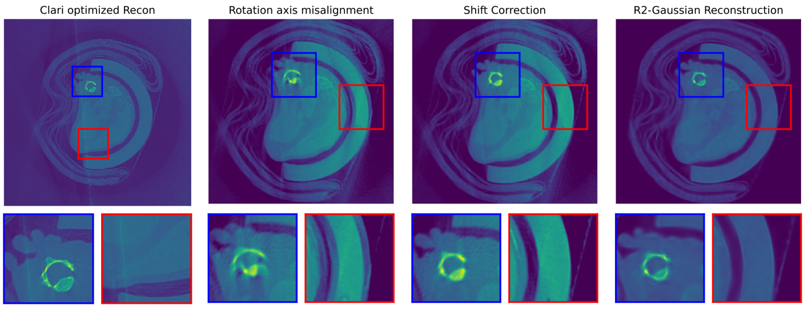

# Discussion & Conclusion (Condensed)

!!! info "Condensed Version"
    The content below is a shortened summary of the original, full-length analysis.  
    Only the key findings are included here. For complete figures, reconstruction curves,  
    and parameter evaluations, refer to the thesis PDF.

## Phantom Experiments
The molded mouse phantom was usable but exhibited several fabrication issues: displaced PLA/SLA components, trapped air bubbles, and imperfect axis alignment due to the object being slightly too large for the CBCT system. These factors, together with slight rotational wobble, contributed to reduced reconstruction quality. BaSO₄ doping increased contrast but not sufficiently to mimic realistic bone.  

The Digimouse digital phantom provided a clean ground truth but was not ideal for R²-Gaussian because large homogeneous regions contain too few gradients to trigger effective densification. As a result, the algorithm performed worse on Digimouse than on real CBCT data.

---

## R²-Gaussian Reconstruction Performance
GPU memory was the dominant limitation. With only 8 GB VRAM, the algorithm was restricted to ~200k Gaussians—far below the capacity used in the original work. At UKMZ resolution (630³ voxels), each Gaussian effectively represented hundreds of voxels, preventing high-frequency anatomical detail from being reconstructed.

Projection downsampling (630×630 → 210×210) further reduced the gradient information required for refining Gaussians. Most out-of-memory errors occurred during voxelization; a more memory-efficient voxelizer could substantially improve feasibility.  

Qualitatively, R²-Gaussian generated smooth, noise-suppressed volumes and remained stable under extreme sparsity, but small structures and edges were consistently blurred due to the limited Gaussian budget.

---

## Technical Limitations
Key constraints:

- **GPU memory**: restricted Gaussian count, early densification stop, reduced iterations, and mandatory projection downsampling.  
- **Evaluation bias**: real datasets used FDK as pseudo ground truth, penalizing R²-Gaussian whenever it deviated from FDK-specific intensity scaling or artifacts.

These factors directly limited achievable reconstruction fidelity.

---

## Summary of Findings
R²-Gaussian was tested on a molded physical phantom, the Digimouse atlas, and real UKMZ mouse scans. The method produced stable reconstructions under sparse-view conditions and outperformed FDK at extremely low projection counts. On real datasets, global structure was reconstructed reliably, but improvements saturated once the Gaussian limit was reached.  

TIGRE-based FDK reconstructions avoided the streak artifact present in UKMZ’s local pipeline, removing the need for Clari post-processing. Limited-angle tests showed partial artifact mitigation but could not compensate for the intrinsic information loss of a 190° orbit.

---

## Feasibility
Under the hardware constraints of this work (8 GB VRAM), Gaussian Splatting is **not yet feasible** for high-resolution preclinical CBCT reconstruction. The representational capacity is insufficient to preserve fine anatomical detail.

However, the method scales strongly with GPU memory. With ≥24 GB VRAM—matching the hardware used in the original publication—higher Gaussian budgets, complete densification schedules, and full voxelization become realistic. Under such conditions, substantially improved reconstruction quality is expected.

---

## Lessons Learned
This project required full end-to-end work with the R²-Gaussian pipeline, including installation, geometry configuration, CUDA debugging, and evaluation across three datasets. It strengthened practical skills in GPU-based optimization, reproducible environments (WSL2, Git, VS Code), error analysis, and CBCT acquisition using a self-built phantom.  

AI tools were helpful for debugging and writing but required a solid understanding of the underlying code to be effective.

---

## Outlook
Future improvements should focus on reducing or eliminating current hardware limitations. Promising directions include:

- Using GPUs with ≥24 GB VRAM for higher Gaussian counts  
- Full-resolution UKMZ reconstructions with increased model capacity  
- Systematic hyperparameter studies under relaxed memory constraints  
- Improved phantom design and geometric calibration  
- Automated axis-shift estimation for UKMZ’s FDK workflow  
- Integration of R²-Gaussian into sparse-view or dose-reduced protocols  
- Optimizing or redesigning the voxelizer for reduced memory usage  

Gaussian Splatting remains a promising method for low-dose and sparse-view preclinical CT, provided that sufficient GPU resources and improved voxelization strategies are available.
