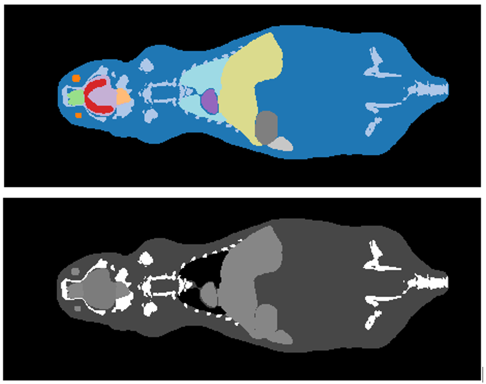
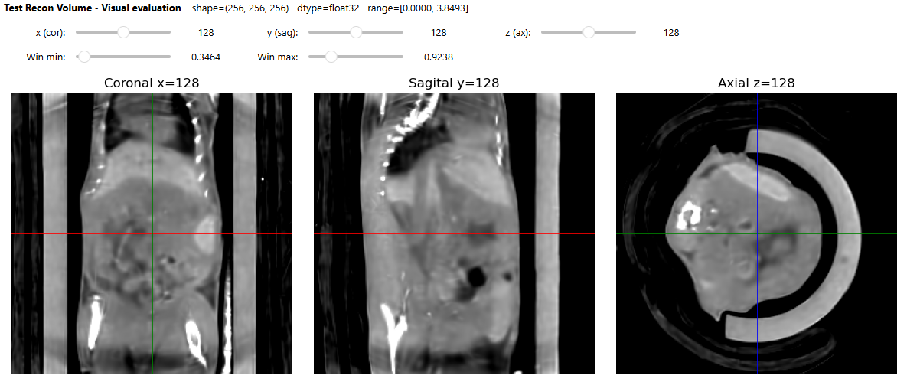

# Materials & Methods (Condensed)

!!! info "Condensed Version"
    The content below is a shortened summary of the original, full-length analysis.  
    Only the key findings are included here. For complete figures, reconstruction curves,  
    and parameter evaluations, refer to the thesis PDF.

## Data & Experimental Design

Three complementary datasets were used to evaluate **R²-Gaussian** against a classical **FDK** baseline:

1. **Molded mouse phantom (MBD CBCT)**  
   Custom physical phantom with BaSO₄-doped skeleton, PLA lungs, and silicone soft tissue, scanned on the low-power laboratory CBCT system to validate the full acquisition–preprocessing–reconstruction pipeline.

   

2. **Synthetic Digimouse atlas**  
   Fully segmented digital mouse model converted to a CT-like attenuation volume. Synthetic cone-beam projections were generated with a cone-beam geometry and realistic noise to obtain a ground-truth benchmark.

   

3. **Real preclinical mouse CT (UKMZ)**  
   High-resolution cone-beam micro-CT datasets acquired on a Yxlon Cheetah system (full 360° and limited 190° trajectories), including tumor-bearing mice, used to assess reconstruction behaviour under realistic anatomy, noise, and system-specific artefacts.

   

---

## Software & Hardware

All reconstructions were performed on a **Windows 11** laptop using **WSL2 (Ubuntu 20.04)** and an **NVIDIA RTX 4060 (8 GB VRAM)**:

- Development in **VS Code (WSL remote)** with Git-based workflow  
- Conda environment with:

       - Python 3.9  
       - CUDA-enabled **PyTorch** and **torchvision**  
       - NumPy, SciPy, scikit-image, SimpleITK, OpenCV, Matplotlib, pyvista  
       - **R²-Gaussian** implementation (Zha et al.)  
       - **TIGRE toolbox** for FDK reconstruction  

GPU memory limitations required using both **full-resolution (≈630³)** and **reduced-resolution (256³)** volumes and limiting the maximum number of Gaussians.

---

## Unified Reconstruction Workflow

All datasets followed the same basic workflow:

1. **Projections**

      - Physical scans (phantom, UKMZ animal data), or  
      - Synthetic forward projections from the Digimouse volume.

2. **Preprocessing**

      - Flat-field correction (dark / open beam)  
      - Log-conversion to line integrals  
      - Intensity normalization and rotation-axis alignment  
      - Projection downsampling when required for GPU feasibility

3. **Reconstruction**

     - **FDK (TIGRE)** as analytic baseline  
     - **R²-Gaussian** as optimization-based method with tuned hyperparameters and a capped Gaussian budget

4. **Evaluation**

      - Full-volume and inner-volume **PSNR/SSIM** (where a reference volume was available)  
      - Sparse-view and limited-angle protocols on UKMZ data  
      - Qualitative slice inspection in a custom multi-planar viewer:

---

## Protocols (Overview Only)

- **Phantom:** full 360° scans, 720 projections, 256³ reconstructions with FDK and R²-Gaussian; used mainly for qualitative validation and geometry/preprocessing checks.
- **Digimouse:** 256³ volume, synthetic noisy projections, FDK and R²-Gaussian comparison using full-volume and inner-volume PSNR/SSIM against the known ground truth.
- **UKMZ full-angle:** 360° / 2000-projection datasets at 630×630 detector resolution; sparse-view experiments (few to many projections) at 256³ and 630³, with FDK as pseudo ground truth.
- **UKMZ limited-angle (190°):** evaluation of reconstruction stability under incomplete angular coverage across varying projection counts and angular ranges.

