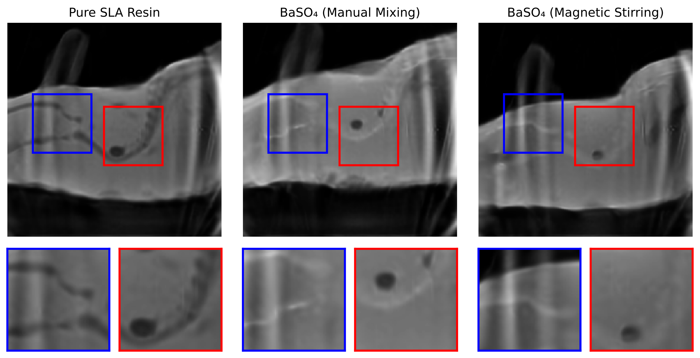
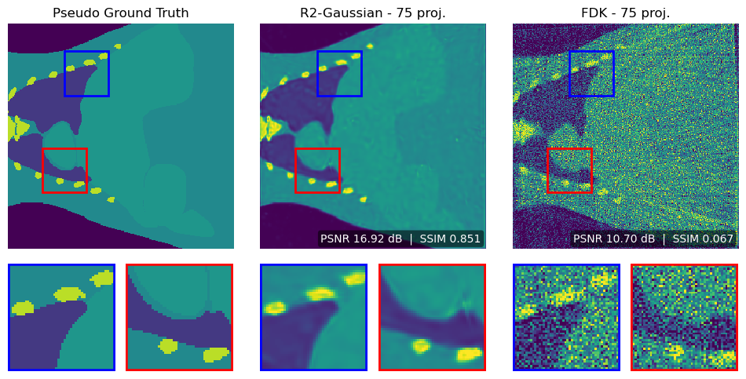
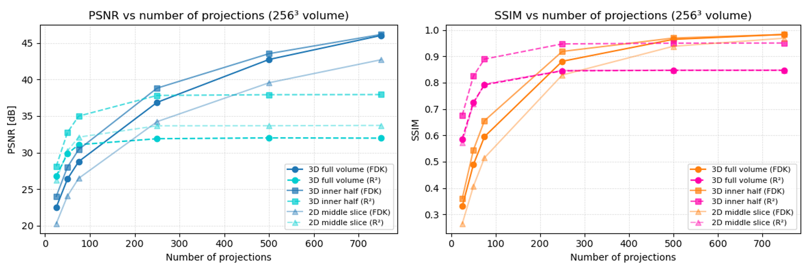
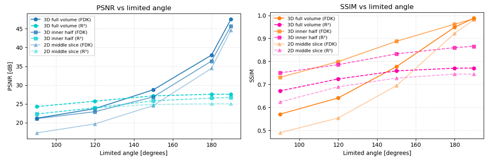
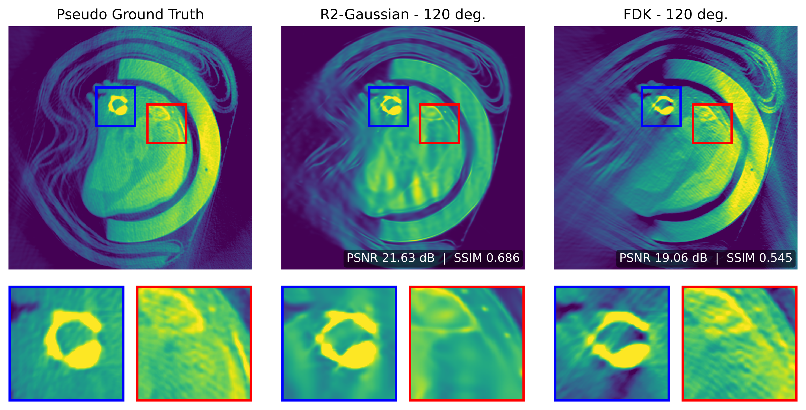

# Results (Condensed)

!!! info "Condensed Version"
    The content below is a shortened summary of the original, full-length analysis.  
    Only the key findings are included here. For complete figures, reconstruction curves,  
    and parameter evaluations, refer to the thesis PDF.

## Hardware Constraints

All reconstructions were performed on an RTX 4060 Laptop GPU (8 GB VRAM).  
Compared to the original R²-Gaussian paper (RTX 3090, 24 GB VRAM), the limited memory strongly restricted:

- usable volume size (mostly 256³, only constrained 630³),
- maximum Gaussians (stable limit ≈ 200k),
- number of iterations (≤ 25k),
- densification duration (≤ 5k iterations),
- projection size (downsampled 630² → 210²).

Most failures were caused by **voxelizer memory allocation** during PSNR/SSIM evaluation:

- `RuntimeError: CUDA out of memory`
- `RuntimeError: numel: integer multiplication overflow`

A stable configuration was established through projection downsampling, early densification stop, Gaussian count limits, and reduced volume sizes.

---

## Molded Phantom

The custom 3-component phantom (silicone body, PLA lungs, BaSO₄-doped SLA skeleton) was successfully fabricated, though some elements shifted during curing and air bubbles remained.

- R²-Gaussian and FDK reconstructions both reflected these imperfections.
- BaSO₄ doping increased skeletal attenuation as expected.
- Minor geometric misalignment and projection shifts were visible in both methods.

---

## Digimouse Atlas (Synthetic Data)

Used to evaluate sparse-view behaviour with a true ground truth.

**Sparse-view performance (25–75 projections):**

- **R²-Gaussian:** PSNR ≈ 29 dB, SSIM ≈ 0.85 (stable across projection counts)  
- **FDK:** Strong degradation in sparse view (PSNR ≈ 10–15 dB)

However, large **homogeneous regions** in Digimouse caused R²-Gaussian to produce **grainy textures**, indicating difficulty representing uniform tissues with limited Gaussian capacity.

---

## Preclinical Mouse Data (UKMZ)

### Rotation-Axis Alignment
A horizontal shift of 5 px (full-angle) and 6 px (limited-angle) maximised reprojection PSNR/SSIM and removed double edges.

### Small-Volume Reconstructions (256³)

- **Sparse-view (<100 projections):**  
  R²-Gaussian outperformed FDK (inner-volume PSNR ≈ 38 dB, SSIM ≈ 0.95).
- **Beyond ~150 projections:**  
  FDK surpassed R²-Gaussian and continued improving, while R²-Gaussian saturated due to Gaussian-count limits.
- **TV regularisation:** negligible effect on reconstruction quality.
- **Intensity-matching strategies:** negligible influence.

### Full-Volume Reconstructions (630³)

Under memory-feasible settings:

- R²-Gaussian again dominated the very sparse-view regime (<100 projections).
- FDK dominated moderate and dense sampling.
- R²-Gaussian saturated at ≈ 37–38 dB PSNR and SSIM ≈ 0.95.

---

## Limited-Angle Reconstructions (190°)

R²-Gaussian showed improved robustness in **extreme limited-angle** settings:

- For <90–120° coverage or very few projections, R²-Gaussian produced fewer angular artefacts than FDK.
- With increasing angular range or projection count, **FDK quickly surpassed R²-Gaussian**.
- R²-Gaussian performance remained capped at ≈ 27 dB / 0.85 SSIM due to the same representational limits observed earlier.

