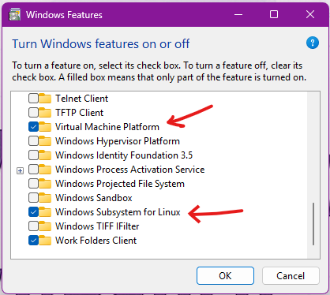
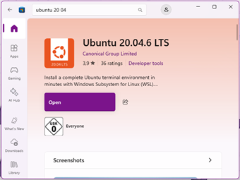
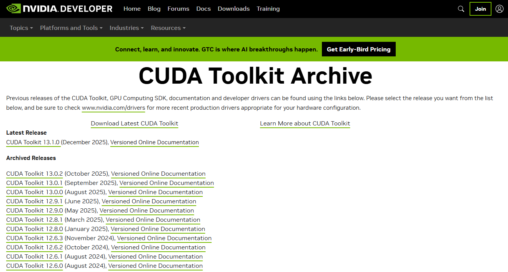

# Installation Guide: R²-Gaussian

This page describes how to install and set up the **R²-Gaussian** reconstruction pipeline on a Windows 11 machine using **WSL2 (Ubuntu 20.04)**, **CUDA 11.8**, **Miniconda**, and **PyTorch**.

Internal usernames, passwords, and proprietary directory structures have been replaced with placeholders. 

Author: M. Handta  
Compatible OS: Windows 11 + WSL2 (Ubuntu 20.04)  
GPU: NVIDIA GPU with CUDA support (tested with RTX 3090 in the original paper) 

---

## Prerequisites

Already correctly installed and functioning:

- Windows 11  
- Visual Studio Code  
- NVIDIA GPU Driver  

Everything else will be explained below.

---

## WSL2 Installation

### 1. Enable Windows Features

Open *Windows Features* and activate:

- **Windows Subsystem for Linux**
- **Virtual Machine Platform**

Check both boxes, save, and **restart your PC** (mandatory).



---

### 2. Install WSL via PowerShell

Run **PowerShell as Administrator**:  

``` powershell
    wsl --install
```   

After installation, set username and password:

- User: *yourusername*
- Password: *yourpassword*

---

### 3. Additional WSL Settings / OS Version

Run again in PowerShell (Admin): 

``` powershell
    wsl --set-default-version 2
```
!!! info
    “We tested the code on Ubuntu 20.04 with an RTX 3090 GPU.” 
                  – R2-gaussian Authors

In the **Microsoft Store**:
Search and install **Ubuntu 20.04.06 LTS**.



You can now start Linux either via:
•	PowerShell:   `wsl`
•	Start Menu: *Ubuntu 20.04.06 LTS*

---

## CUDA Toolkit Installation

### 1. Check Existing CUDA Installation

Open Ubuntu (WSL) terminal: 

``` bash
    nvcc --version
``` 

If **CUDA 11.6** or **11.8** (recommended by Gaussian Splatting authors) is installed, proceed to Git/VS Code setup.

If an older / unwanted version is installed, remove it:

``` bash
    sudo apt purge -y "cuda*" "nvidia-cuda*" "nsight*"
    
    sudo apt autoremove -y
    
    sudo rm -rf /usr/local/cuda*
``` 

Check removal:
``` bash
    ls /usr/local | grep cuda
```
Check Nvidia driver:
``` bash
    nvidia-smi
```

---

### 2. Install CUDA Toolkit 11.8
Go to:
[CUDA Toolkit Archive | NVIDIA Developer](https://developer.nvidia.com/cuda-toolkit-archive)

Select **CUDA 11.8** for **Ubuntu 20.04** and follow instructions.
 

 
Verified working commands:

Install prerequisites

``` bash
    sudo apt update
    
    sudo apt install -y wget gnupg2 ca-certificates
```

Add NVIDIA CUDA repo for Ubuntu 20.04

``` bash
    wget https://developer.download.nvidia.com/compute/cuda/repos/ubuntu2004/x86_64/cuda-ubuntu2004.pin
    
    sudo mv cuda-ubuntu2004.pin /etc/apt/preferences.d/cuda-repository-pin-600
    
    wget https://developer.download.nvidia.com/compute/cuda/11.8.0/local_installers/cuda-repo-ubuntu2004-11-8-local_11.8.0-520.61.05-1_amd64.deb
    
    sudo dpkg -i cuda-repo-ubuntu2004-11-8-local_11.8.0-520.61.05-1_amd64.deb
    
    sudo cp /var/cuda-repo-ubuntu2004-11-8-local/cuda-*-keyring.gpg /usr/share/keyrings/
    
    sudo apt update
```

**IMPORTANT**: 

``` bash
	sudo apt install -y cuda-toolkit-11-8
```

This installs **nvcc**, headers, and libraries.

---

### 3. Add CUDA to PATH

Edit your bashrc:

``` bash
    nano ~/.bashrc
```

Add to bottom:

``` bash
    export PATH=/usr/local/cuda-11.8/bin:$PATH
    export LD_LIBRARY_PATH=/usr/local/cuda-11.8/lib64:$LD_LIBRARY_PATH
```

Apply:

``` bash
    source ~/.bashrc
```

---

### 4. Verify CUDA Installation

``` bash
    nvcc --version
```

Expected: 

``` text
Cuda compilation tools, release 11.8, V11.8.xxx
```

Check driver:

``` bash
    nvidia-smi
```

---

## Miniconda, Git & VScode setup

### 1. Install Miniconda

Download Miniconda (Linux x86_64, recommended over Anaconda)

``` bash
    cd ~
    
    wget https://repo.anaconda.com/miniconda/Miniconda3-latest-Linux-x86_64.sh
```

Run installer

``` bash
    bash Miniconda3-latest-Linux-x86_64.sh
```

During installation:
- Accept license
- Default installation path (press ENTER)
- Initialize Miniconda → yes

Reload:

``` bash
    source ~/.bashrc
```

Verify:
``` bash
    conda --version
```

---

### 2. Configure conda (important)

``` bash
    conda config --set auto_activate_base false
    
    conda config --set channel_priority strict
```

Activate: 

``` bash
    conda activate 
```

Check Python path:

``` bash
    which python
```

Expected:

``` bash
/home/mbdusr/miniconda3/envs/torch118/bin/python
```

If you see `/mnt/c/...` → wrong, using Windows Python.

---

### 3. Install Git

WSL needs its own Git installation:

``` bash
    sudo apt update
    
    sudo apt install -y git
    
    git –version
```

--- 

### 4. Configure VS Code for WSL

Do **not** install VS Code inside Ubuntu.

On Windows:

- Open VS Code
- Install extension **“WSL” (Microsoft)**

Open VS Code from Ubuntu:

```bash
    cd ~
    
    code .
```

VS Code Server installs automatically.
Bottom left will show: **WSL: Ubuntu-20.04**

## Cloning the R2-Gaussian Repository

Repo: [R2-Gaussian](https://github.com/Ruyi-Zha/r2_gaussian.git)

**Clone repo (WSL)**
Always clone inside Linux home, not Windows folders.

``` bash
    cd ~
    
    git clone https://github.com/Ruyi-Zha/r2_gaussian.git --recursive
```

Open in VS Code

``` bash
    cd r2_gaussian
    
    code .
```

---

## Install submodules and Tigre-toolbox

Below is the link to the installation guide provided by the R2-Gaussian authors:

[R2-gaussian Installation](https://github.com/Ruyi-Zha/r2_gaussian/tree/main?tab=readme-ov-file#1-installation)

If their instructions do not work, follow the full detailed guide below.

If you did **not** clone the repository with `--recursive`, do it now:

``` bash
    git clone https://github.com/Ruyi-Zha/r2_gaussian.git --recursive
```

### 1. Create r2_gaussian Conda Environment

First create a dedicated conda environment:

``` bash
    conda create -n r2_gaussian python=3.9 -y
    
    conda activate r2_gaussian
```

Install PyTorch (CUDA 11.8 compatible):

``` bash
    pip install torch==2.1.2+cu118 torchvision==0.16.2+cu118 --extra-index-url https://download.pytorch.org/whl/cu118
```

Install all Python requirements from the repo:

``` bash
    pip install -r requirements.txt
```
??? info 
    If you forgot to clone recursively earlier (submodules missing), execute:

    ``` bash
        git submodule update --init --recursive) 
    ```

    Check:

    ``` bash
        ls r2_gaussian/submodules/simple-knn
    ```

    You should see things like:
    ``` bash
        setup.py     simple_knn/     src/
    ```

---

### 2. Install Submodules (CUDA Extensions)

The repository contains two CUDA-based Python submodules that must be built manually:

- **simple-knn**
- **xray-gaussian-rasterization-voxelization**

These must be installed editable and **with build isolation disabled**, otherwise Python will try to create a temporary build environment and will not find your Torch installation, resulting in: 

``` bash
ModuleNotFoundError: No module named 'torch' 
```

To install correctly, run: 

``` bash
    pip install -e r2_gaussian/submodules/simple-knn  --no-build-isolation
    
    pip install -e r2_gaussian/submodules/xray-gaussian-rasterization-voxelization --no-build-isolation
```

!!! info "**Why `--no-build-isolation` is essential**"
    By disabling build isolation:

    - the build system sees your **active conda environment**,
    - torch and its CUDA headers are visible,
    - the extension compiles against the correct CUDA toolkit,
    - compatibility issues with PyTorch + CUDA are avoided.

    This is a common requirement for research repositories containing custom CUDA kernels.

Verify successful installation:

``` bash
    Python -c “import simple_knn; print(‘simple_knn OK’)” 
```

---

### 3. Install TIGRE toolbox

R2-Gaussian relies on parts of the TIGRE toolbox for projection / reconstruction operations.

You need to install TIGRE in Python mode with build isolation disabled.
Download the official TIGRE release (v2.3):

``` bash
    wget https://github.com/CERN/TIGRE/archive/refs/tags/v2.3.zip
    
    unzip v2.3.zip
```

Install:
 
``` bash
    pip install TIGRE-2.3/Python --no-build-isolation
```

This installs the Python interface without re-compiling unnecessary MATLAB components.

---

### 4. Add Submodule to Python PATH

Even after pip installation, you may encounter:

``` text
ModuleNotFoundError: No module named 'simple_knn'
```

This happens because the repository’s internal module structure expects the **repository root** to be available in **PYTHONPATH**, and pip alone does not fully solve this for all relative imports.

To prevent this issue, you need to add the submodules to your Python search path.

!!! info "**Temporary fix (only for current terminal session)**"
    Run:

    ``` bash
        export PYTHONPATH="$HOME/Bachelorthesis/r2_gaussian/r2_gaussian/submodules/simple-knn:$HOME/Bachelorthesis/r2_gaussian/r2_gaussian/submodules/xray-gaussian-rasterization-voxelization"
    ```

	This works until you close the terminal.


!!! info "**Permanent Fix (recommended)**"
    Open .bashrc

    ```bash
        nano ~/.bashrc
    ```

    Add the following single-line entry at the very bottom:

    ``` bash
        # R2 Gaussian submodules
        export PYTHONPATH="$HOME/r2_gaussian/r2_gaussian/submodules/simple-knn:$HOME/r2_gaussian/r2_gaussian/submodules/xray-gaussian-rasterization-voxelization:$PYTHONPATH"
    ```

    Important details:

    - Must be one line (avoid unwanted line breaks).
    - Keep :$PYTHONPATH at the end → preserves existing search paths.
    - Use absolute paths, otherwise imports may fail depending on where Python is executed.

    Save and exit: 

    - Ctrl+O → Enter
    - Ctrl+X

    Reload:

    ``` bash
        source ~/.bashrc
    ```

    Verify permanent accessibility:

    ``` bash
        python -c "import simple_knn; print('simple_knn OK')"
    ```

--- 

**Author**: Manuel Handta

**Version**: 1.0 – December 2025

**Purpose**: Installation documentation for R²-Gaussian reconstruction pipeline

